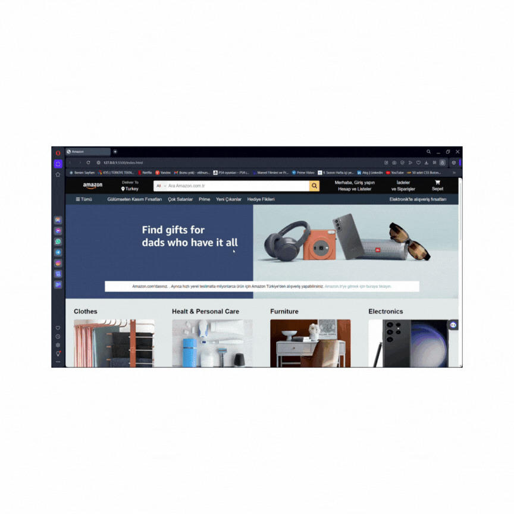

# Amazon Homepage Clone
- This project includes an Amazon homepage clone created using HTML and CSS. Mimicking the design of Amazon's homepage, this project includes product cards, a search bar, menus, and other essential elements.

## Technologies Used
- HTML5
- CSS3

## How to Run
- You can run the project by cloning it to your computer or downloading the ZIP file and following these steps:

1. Clone the repository to your computer: 'git clone https://github.com/username/trendyol-like-site.git' 
2. Navigate to the project directory: 'cd trendyol-like-site'
3. Open the 'index.html' file in a web browser.

## GIF 

